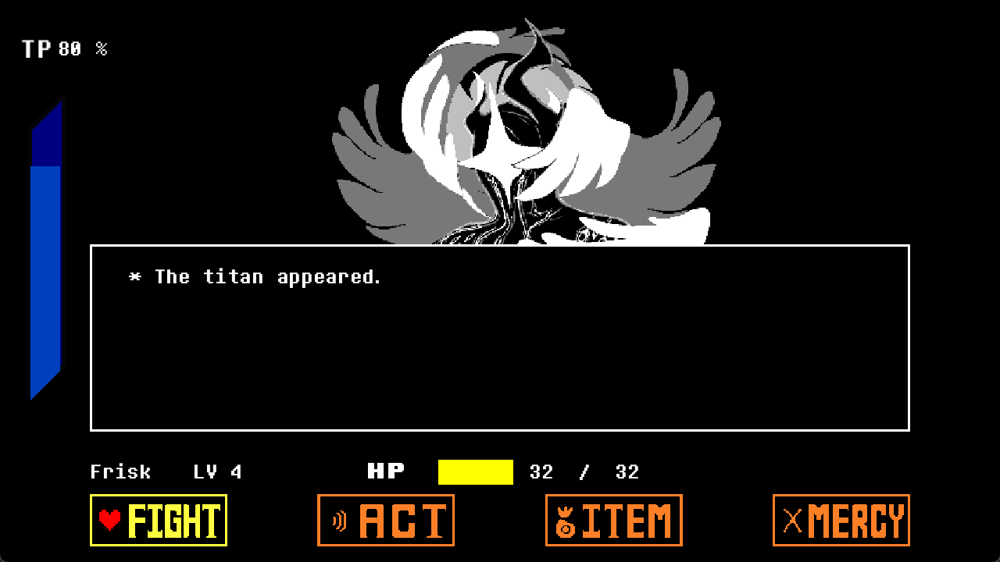

# Java Undertale

## 项目简介
本项目为 Java 实现的 Undertale 战斗系统，复刻Deltarune中第四章的titan战斗。基于 LWJGL（Lightweight Java Game Library）开发。项目采用面向对象设计，包含动画、场景、UI、音效、存档等完整模块。

本项目已作为设计模式期末项目进行设计模式重构，具体重构内容可参考`doc/`

## 项目结构
- `src/main/java/undertale/`：核心源码（动画、敌人、场景、UI、工具等）
- `src/main/resources/`：游戏资源（图片、音效、配置等）
- `doc/`：设计文档、UML 图

## 环境要求
- JDK 21
- Maven 3.6

## 主要依赖
- LWJGL 3.x（OpenGL、GLFW、OpenAL 等）
- Gson（配置解析）

## 构建与运行
1. 安装 JDK 和 Maven，并配置环境变量
2. 克隆本仓库，进入项目根目录
3. 执行 `mvn package`，在`target/`目录下自动生成 exe、jar、依赖和 natives
4. 运行：
	- `target/mygame.exe`
	- 或：`java -jar target/undertale-1.0-SNAPSHOT.jar`
	- 也可通过 IDEA/vscode的code runner直接运行 Main.java

## 游戏操作方法
- 方向键：移动player
- Z：确认
- X：取消/返回
- ESC：长按退出游戏
- SHIFT：减速

## 游戏截图

