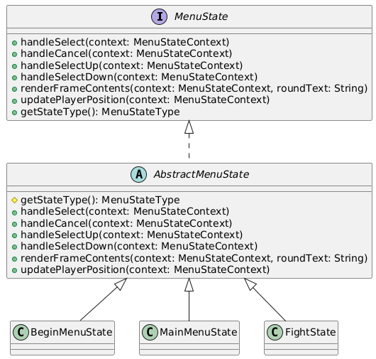
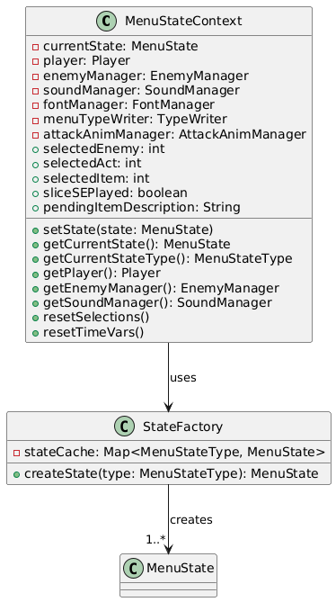
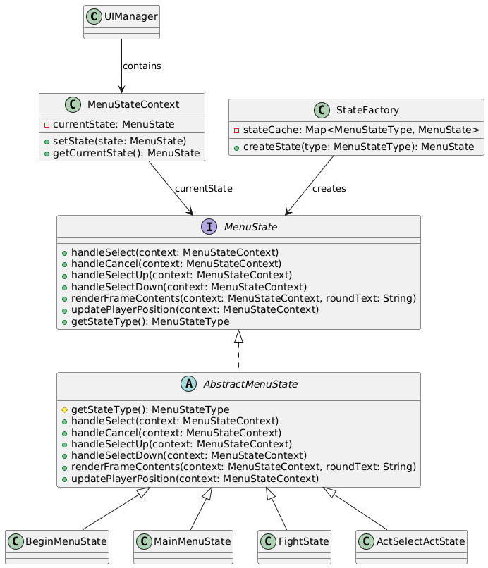
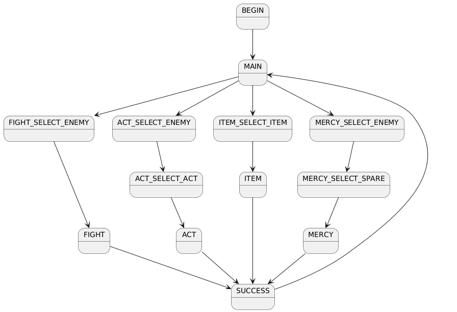

# UI菜单系统状态模式重构

## 1. 重构概述

本次重构将UIManager中基于enum和switch语句的状态管理重构为**状态模式(State Pattern)**，提高了代码的可维护性和可扩展性。

### 重构日期
2025/11/29

### 重构范围
UI菜单状态管理系统

---

## 2. 涉及的文件

### 2.1 修改的文件（5个）

| 文件路径 | 修改说明 |
|---------|---------|
| `src/main/java/undertale/UI/UIManager.java` | 核心重构文件，移除enum和switch逻辑，引入状态模式 |
| `src/main/java/undertale/Scene/BattleMenuScene.java` | 适配新的UIManager接口 |
| `src/main/java/undertale/Scene/BeginMenuScene.java` | 适配新的UIManager接口 |
| `src/main/java/undertale/Scene/GameOverScene.java` | 适配新的UIManager接口 |
| `src/main/java/undertale/GameMain/Game.java` | 适配新的UIManager接口 |

### 2.2 新增的文件（18个）

#### 核心接口和抽象类
- `src/main/java/undertale/UI/state/MenuState.java` - 状态接口
- `src/main/java/undertale/UI/state/AbstractMenuState.java` - 抽象状态基类
- `src/main/java/undertale/UI/state/MenuStateContext.java` - 状态上下文
- `src/main/java/undertale/UI/state/StateFactory.java` - 状态工厂
- `src/main/java/undertale/UI/state/MenuStateType.java` - 状态类型枚举

#### 具体状态类（13个）
- `BeginMenuState.java` - 开始菜单状态
- `MainMenuState.java` - 主菜单状态
- `FightSelectEnemyState.java` - 选择攻击敌人状态
- `FightState.java` - 攻击状态
- `ActSelectEnemyState.java` - 选择行动敌人状态
- `ActSelectActState.java` - 选择行动类型状态
- `ActState.java` - 行动状态
- `ItemSelectItemState.java` - 选择物品状态
- `ItemState.java` - 使用物品状态
- `MercySelectEnemyState.java` - 选择宽恕敌人状态
- `MercySelectSpareState.java` - 选择宽恕方式状态
- `MercyState.java` - 宽恕状态
- `SuccessState.java` - 胜利状态

---

## 3. 重构前后对比

### 3.1 架构对比

#### 重构前：基于enum + switch的实现

```java
public class UIManager {
    // 使用枚举定义状态
    public enum MenuState {
        BEGIN, MAIN, FIGHT_SELECT_ENEMY, FIGHT,
        ACT_SELECT_ENEMY, ACT_SELECT_ACT, ACT,
        ITEM_SELECT_ITEM, ITEM,
        MERCY_SELECT_ENEMY, MERCY_SELECT_SPARE, MERCY,
        SUCCESS
    }
    
    public MenuState menuState = MenuState.BEGIN;
    
    // 大量的switch语句处理不同状态
    public void handleMenuSelect() {
        if(menuState == MenuState.SUCCESS && ...) {
            // 处理SUCCESS状态
        }
        else if (menuState == MenuState.MAIN) {
            menuState = switch(selectedAction) {
                case 0 -> MenuState.FIGHT_SELECT_ENEMY;
                case 1 -> MenuState.ACT_SELECT_ENEMY;
                // ...
            };
        }
        else {
            menuState = switch(menuState) {
                case FIGHT_SELECT_ENEMY -> MenuState.FIGHT;
                case ACT_SELECT_ENEMY -> MenuState.ACT_SELECT_ACT;
                // 更多case...
            };
        }
    }
    
    public void renderFrameContents(String roundText) {
        switch(menuState) {
            case BEGIN -> {}
            case FIGHT_SELECT_ENEMY -> renderEnemyList();
            case ACT_SELECT_ACT -> renderActList();
            // 13个case分支...
        }
    }
    
    // handleMenuCancel, menuSelectUp, menuSelectDown
    // 都包含大量的switch语句...
}
```

**问题：**
- ❌ 违反开闭原则：添加新状态需要修改多处switch语句
- ❌ 代码臃肿：UIManager类超过500行
- ❌ 职责不清：一个类承担了所有状态的逻辑
- ❌ 难以测试：状态之间的逻辑耦合严重

#### 重构后：状态模式实现

```java
// 1. 状态接口
public interface MenuState {
    void handleSelect(MenuStateContext context);
    void handleCancel(MenuStateContext context);
    void handleSelectUp(MenuStateContext context);
    void handleSelectDown(MenuStateContext context);
    void renderFrameContents(MenuStateContext context, String roundText);
    void updatePlayerPosition(MenuStateContext context);
    MenuStateType getStateType();
}

// 2. 抽象基类（提供默认实现）
public abstract class AbstractMenuState implements MenuState {
    @Override
    public void handleCancel(MenuStateContext context) {
        // 默认实现：什么都不做
    }
    // 其他默认实现...
}

// 3. 具体状态类
public class MainMenuState extends AbstractMenuState {
    @Override
    public void handleSelect(MenuStateContext context) {
        context.getSoundManager().playSE("confirm");
        MenuStateType nextState = switch(context.selectedAction) {
            case 0 -> MenuStateType.FIGHT_SELECT_ENEMY;
            case 1 -> MenuStateType.ACT_SELECT_ENEMY;
            case 2 -> MenuStateType.ITEM_SELECT_ITEM;
            case 3 -> MenuStateType.MERCY_SELECT_ENEMY;
            default -> MenuStateType.MAIN;
        };
        context.setState(StateFactory.createState(nextState));
    }
    
    @Override
    public void renderFrameContents(MenuStateContext context, String roundText) {
        context.getMenuTypeWriter().renderTextsInMenu(roundText);
    }
    // 其他方法...
}

// 4. 状态上下文
public class MenuStateContext {
    private MenuState currentState;
    private Player player;
    private EnemyManager enemyManager;
    // 其他依赖和共享数据...
    
    public void setState(MenuState state) {
        this.currentState = state;
    }
}

// 5. 状态工厂
public class StateFactory {
    private static final Map<MenuStateType, MenuState> stateCache = new HashMap<>();
    
    static {
        stateCache.put(MenuStateType.BEGIN, new BeginMenuState());
        stateCache.put(MenuStateType.MAIN, new MainMenuState());
        // 预创建所有状态...
    }
    
    public static MenuState createState(MenuStateType type) {
        return stateCache.get(type);
    }
}

// 6. 简化的UIManager
public class UIManager {
    private MenuStateContext context;
    
    public void handleMenuSelect() {
        context.getCurrentState().handleSelect(context);
    }
    
    public void renderFrameContents(String roundText) {
        context.getCurrentState().renderFrameContents(context, roundText);
    }
    // 方法大幅简化...
}
```

**优势：**
- ✅ 符合开闭原则：新增状态只需添加新类，无需修改现有代码
- ✅ 单一职责：每个状态类只负责自己的行为
- ✅ 易于维护：状态逻辑清晰独立
- ✅ 易于测试：可以独立测试每个状态
- ✅ 代码复用：通过AbstractMenuState提供公共实现

### 3.2 关键改进点

| 方面 | 重构前 | 重构后 |
|-----|-------|-------|
| **代码行数** | UIManager ~500+ 行 | UIManager ~200行 + 13个状态类 |
| **switch语句** | 5处大型switch | 0处（分散到各状态类） |
| **状态转换** | 集中在UIManager中 | 由各状态类自行管理 |
| **依赖注入** | 通过方法参数传递 | 通过Context统一管理 |
| **可扩展性** | 低（需修改多处） | 高（只需添加新类） |
| **可测试性** | 低（状态耦合） | 高（状态独立） |

---

## 4. UML类图

### 4.1 状态模式核心结构



### 4.2 状态上下文与工厂



### 4.3 类关系图



### 4.4 状态转换图



---

## 5. 设计模式应用

### 5.1 状态模式 (State Pattern)

**意图：** 允许对象在内部状态改变时改变它的行为，对象看起来似乎修改了它的类。

**关键角色：**
- **Context (MenuStateContext):** 维护一个具体状态的实例，这个实例定义了当前状态
- **State (MenuState):** 定义一个接口，封装与Context的一个特定状态相关的行为
- **ConcreteState (BeginMenuState, MainMenuState等):** 每个子类实现与Context的一个状态相关的行为

### 5.2 工厂模式 (Factory Pattern)

**StateFactory** 使用工厂模式创建状态实例：
- 使用静态缓存避免重复创建
- 提供统一的创建接口
- 便于状态实例的管理

### 5.3 模板方法模式 (Template Method Pattern)

**AbstractMenuState** 提供了默认的方法实现：
- 子类可以选择性地覆盖需要的方法
- 减少代码重复
- 统一处理公共逻辑

---

## 6. 重构收益

### 6.1 可维护性提升
- 每个状态的逻辑独立在单独的类中
- 修改某个状态不会影响其他状态
- 代码结构清晰，易于理解

### 6.2 可扩展性提升
- 添加新状态只需：
  1. 在MenuStateType枚举中添加新状态类型
  2. 创建新的状态类继承AbstractMenuState
  3. 在StateFactory中注册新状态
- 无需修改现有代码

### 6.3 可测试性提升
- 每个状态类可以独立进行单元测试
- 通过Mock MenuStateContext可以测试状态转换
- 降低测试复杂度

### 6.4 符合SOLID原则
- **单一职责原则 (SRP):** 每个状态类只负责一种状态的行为
- **开闭原则 (OCP):** 对扩展开放，对修改封闭
- **里氏替换原则 (LSP):** 所有状态类可以互相替换
- **接口隔离原则 (ISP):** MenuState接口定义了清晰的职责
- **依赖倒置原则 (DIP):** UIManager依赖于MenuState抽象而非具体实现

---

## 7. 性能考虑

### 7.1 状态实例缓存
StateFactory使用静态Map缓存所有状态实例，避免运行时频繁创建对象：
```java
static {
    stateCache.put(MenuStateType.BEGIN, new BeginMenuState());
    // 预创建所有状态...
}
```

### 7.2 状态切换开销
- 状态切换只是改变Context中的引用，开销极小
- 相比重构前的多层if-else和switch，性能略有提升

---

## 8. 未来改进建议

1. **状态持久化：** 考虑添加状态的保存和恢复机制
2. **状态历史：** 实现状态栈，支持更复杂的状态回退
3. **状态动画：** 添加状态转换动画效果
4. **配置化：** 将状态转换规则配置化，提高灵活性

---

## 9. 总结

本次重构成功将UIManager从一个包含大量switch语句的臃肿类，重构为使用状态模式的清晰架构：

- **重构前：** 500+行的UIManager + enum
- **重构后：** 200行的UIManager + 18个独立的状态相关类

重构大幅提升了代码的：
- ✅ 可维护性
- ✅ 可扩展性
- ✅ 可测试性
- ✅ 可读性

符合现代软件工程的最佳实践，为后续功能扩展奠定了良好的基础。

---

**文档版本：** 1.0  
**最后更新：** 2025/11/29  
**作者：** Refactoring Team
