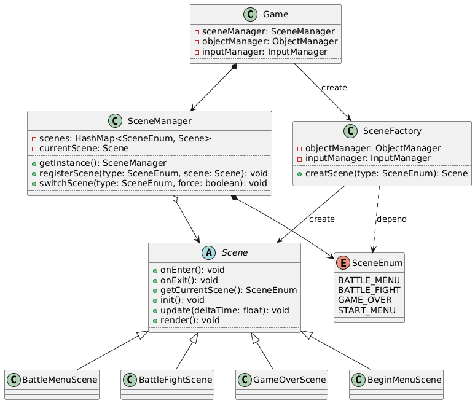
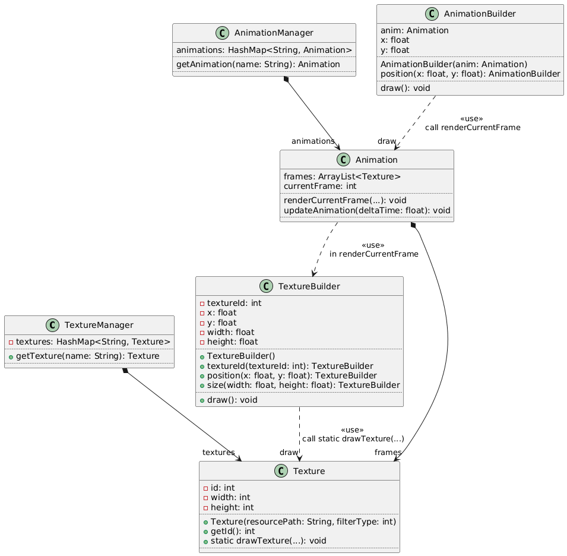
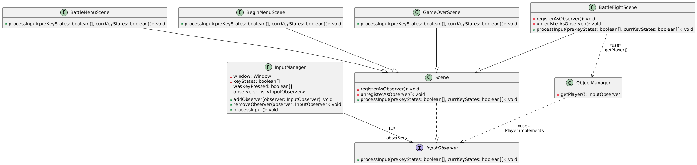

# Creational - Factory Pattern
- The Factory Pattern is a creational design pattern that provides a way to create objects without specifying the exact class of object that will be created. By using factory methods, client code can be decoupled from concrete classes, thereby improving code flexibility and maintainability.

- refactored files:
    - SceneFactory.java (new file)
    - Game.java

- In the refactoring of this project, the `SceneFactory` class is used to create different types of scene objects.
- The core method of `SceneFactory` is `createScene(SceneEnum type)`, which decides which specific scene object to create based on the passed scene type enumeration value.
```java
public Scene creatScene(SceneEnum type) {
    return switch (type) {
        case BATTLE_MENU -> new BattleMenuScene(objectManager, inputManager);
        case BATTLE_FIGHT -> new BattleFightScene(objectManager, inputManager);
        case GAME_OVER -> new GameOverScene(objectManager, inputManager);
        case START_MENU -> new BeginMenuScene(objectManager, inputManager);
    };
}
```

- With `SceneFactory` managing the creation of scene classes, the `Game` class no longer directly depends on specific scene classes, but instead obtains the required scene instances through the factory.

```java
// Game.java
// use START_MENU as an example
// previous code
sceneManager.registerScene(Scene.SceneEnum.START_MENU,
                           new BeginMenuScene(objectManager, inputManager));
// refactored code
sceneManager.registerScene(SceneEnum.START_MENU,
                           sceneFactory.creatScene(SceneEnum.START_MENU));
```

- Class diagram after using Factory Pattern



# Creational - Builder Pattern
- The Builder Pattern is a creational design pattern that separates the construction of a complex object from its representation, allowing the same construction process to create different representations.

- refactored files:
    - TextureBuilder.java (new file)
    - AnimationBuilder.java (new file)
    - Texture.java
    - Animation.java
    - other files that use Texture and Animation drawing methods

- In this project, the `TextureBuilder` class and `AnimationBuilder` class are implemented to handle the drawing of textures and animations.
- Since they are similar, `TextureBuilder` is used as an example here.

- Before refactoring, texture drawing was unified by calling the static method `drawTexture` of `Texture`.
- Because many variables need to be passed to `drawTexture`, calling this method requires passing a large number of parameters, resulting in poor code readability and inconvenient parameter setting.
- Most of the time, many variables use default values, so many overloaded functions were provided for convenience. However, this led to the `Texture` class being filled with a large number of overloaded `drawTexture` methods, making the code bloated and difficult to maintain, and hard to remember which overloaded versions exist.
```java
// previous code
public static void drawTexture(int textureId, float x, float y, float width, float height, float rotation, float r, float g, float b, float a, float u0, float v0, float u1, float v1, String shaderName, Consumer<Integer> uniformSetter)

public static void drawTexture(int textureId, float x, float y, float width, float height, float rotation, float r, float g, float b, float a, boolean horizontalReverse, boolean verticalReverse)

public static void drawTexture(int textureId, float x, float y, float width, float height, float rotation, float r, float g, float b, float a)
// ... many other overloads
```

- After refactoring, the `TextureBuilder` class was introduced to encapsulate various parameters required for drawing textures, providing chainable methods to set these parameters, and finally calling the `draw()` method for drawing. The `Texture.drawTexture` method retains only one most complete version responsible for the actual drawing work.
- Specific implementation:

- The `TextureBuilder` class saves all variables needed for drawing a Texture as private member variables and provides default values. It provides a `public void draw()` method to call these variables for drawing.
```java
private int textureId;
private float x;
private float y;
private float width;
private float height;
private float rotation;
private float[] u = new float[2];
private float[] v = new float[2];
private float[] rgba = new float[4];
private String shaderName;
private Consumer<Integer> uniformSetter;

// Call the drawTexture method provided by the Texture class to draw
public void draw() {
    Texture.drawTexture(textureId, x, y, width, height, rotation, rgba[0], rgba[1], rgba[2], rgba[3], u[0], v[0], u[1], v[1], shaderName, uniformSetter);
}
```

- The `TextureBuilder` class also provides a series of chainable methods to set these variables, for example `setTextureId`:
```java
public TextureBuilder setTextureId(int textureId) {
    this.textureId = textureId;
    return this;
}
```

- The benefit of this is supporting method chaining, making it very convenient to set multiple variables, for example:
```java
new TextureBuilder().textureId(currentTexture.getId())
    .position(this.x, this.y)
    .size(hScale * currentTexture.getWidth(), vScale * currentTexture.getHeight())
    .rotation(getSelfAngle())
    .rgba(rgba[0], rgba[1], rgba[2], rgba[3])
    .draw();
```

- This approach not only improves code readability but also avoids the maintenance cost of a large number of overloaded methods, and makes it very convenient to add new parameter setting methods, improving code extensibility.

- Class diagram after using Builder Pattern


# Behavioral - Observer Pattern
- The Observer Pattern is a behavioral design pattern that defines a one-to-many dependency between objects so that when one object changes state, all its dependents are notified and updated automatically.

- refactored files:
    - InputObserver.java (new file)
    - InputManager.java
    - Scene.java
    - BattleMenuScene.java
    - BattleFightScene.java
    - BeginMenuScene.java
    - GameOverScene.java
    - Player.java
    - DebugInputObserver.java (new file)
    - EscapeInputObserver.java (new file)

- Before refactoring, `InputManager` held objects of classes that needed to judge input, such as `ObjectManager`, `UIManager`, `SceneManager`, `Player`, as member variables, and directly called methods of these classes inside the `InputManager` class to handle input events. This led to high coupling between the `InputManager` class and these classes, making it difficult to maintain and extend.
```java
// previous code
public void processInput() {
    // ...
    switch(sceneManager.getCurrentScene().getCurrentScene()) {
        case BATTLE_FIGHT -> handlePlayerMovement();
        case BATTLE_MENU -> handleMenuChoose();
        case GAME_OVER -> processGameOverInput();
        case START_MENU -> processBeginMenuInput();
    }
}
// and those handle methods directly call methods of Player, SceneManager, UIManager, etc.
// for example:
private void handleMenuChoose() {
    if(isKeyTriggered(GLFW_KEY_RIGHT)) {
        uiManager.selectMoveRight();
    }
    if(isKeyTriggered(GLFW_KEY_LEFT)) {
        uiManager.selectMoveLeft();
    }
    if(isKeyTriggered(GLFW_KEY_Z)) {
        uiManager.handleMenuSelect();
    }
    if(isKeyTriggered(GLFW_KEY_X)) {
        uiManager.handleMenuCancel();
    }
    if(isKeyTriggered(GLFW_KEY_UP)) {
        uiManager.menuSelectUp();
    }
    if(isKeyTriggered(GLFW_KEY_DOWN)) {
        uiManager.menuSelectDown();
    }
}
```

- Therefore, the Observer Pattern was used for refactoring. The `InputManager` class was designed as the Subject, and classes that need to respond to input events (such as `Player`, `BattleFightScene`, `BattleMenuScene`, `DebugInputObserver`, `EscapeInputObserver`) were designed as Observers.
- The `InputManager` class maintains a list of observers. When the input state changes, it calls the `notifyObservers()` method to notify all registered observers to update accordingly.

```java
private List<InputObserver> observers = new ArrayList<>();

public void processInput() {
    updateKeyState();
    for(InputObserver observer : observers) {
        observer.processInput(wasKeyPressed, keyStates);
    }
}
```

- Classes that need to implement input response implement the `InputObserver` interface and handle specific input logic in the `processInput` method.
```java
// InputObserver interface
public interface InputObserver {
    public void processInput(boolean[] preKeyStates, boolean[] currKeyStates);
}

// classes implementing InputObserver(using Scene as an example)
public abstract class Scene implements InputObserver {
    protected void registerAsObserver() {
        inputManager.addObserver(this);
    }
    protected void unregisterAsObserver() {
        inputManager.removeObserver(this);
    }
}

public class BattleMenuScene extends Scene {
    @Override
    public void onEnter() {
        registerAsObserver();
        // other codes...
    }

    @Override
    public void onExit() {
        unregisterAsObserver();
        // other codes...
    }

    @Override
    public void processInput(boolean[] preKeyStates, boolean[] currKeyStates) {
        if(currKeyStates[GLFW_KEY_RIGHT] && !preKeyStates[GLFW_KEY_RIGHT]) {
            uiManager.selectMoveRight();
        }
        // other input handling codes...
    }
}
```

- Thus, the refactored `InputManager` class no longer directly depends on any other specific game-related classes, but interacts with observers through the observer interface. `InputManager` itself only needs to update and provide the key states of the previous frame and the current state, improving code flexibility, simplicity, and maintainability.

- Class diagram after using Observer Pattern
