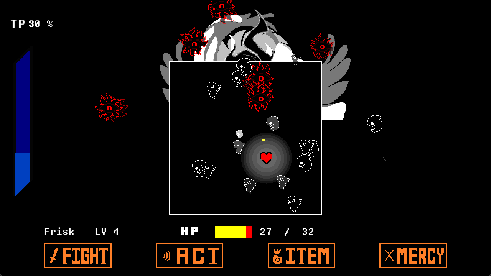
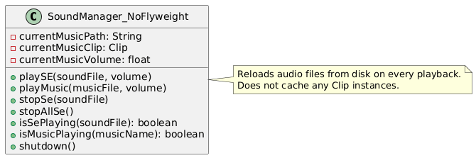
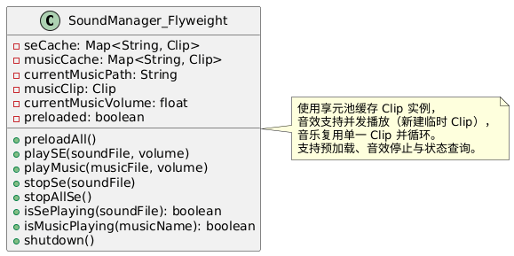
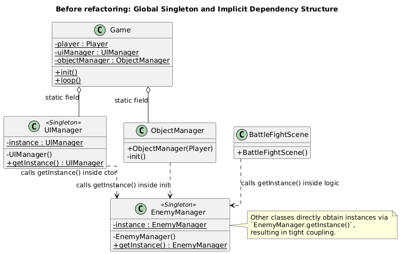
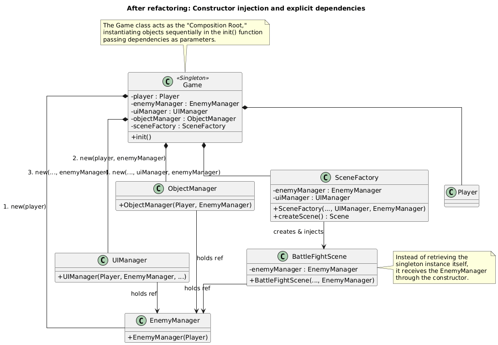

# Software Design Pattern-Porject Refactoring Documentation
## Project Name and member information
- Project Name: Undertale Battle System implementation with java
- Group Number: 1
- Group Members:

## Project Introduction
- This project implements the battle system of the game "Undertale" using Java, coupled with packages like LWJGL.

### Project Modules
- **Texture Module**: Responsible for loading, managing, and rendering game textures using OpenGL API. It utilizes `TextureManager` for resource management.
- **Animation Module**: Manages sprite-based animations. It supports defining animation sequences and playing them on game objects. It utilizes `AnimationManager` for animation management.
- **Shader Management Module**: Handles the compilation, linking, and usage of GLSL shaders through `ShaderManager`, allowing for custom visual effects and rendering pipelines.
- **GameObject Module**: The core entity system based on the Composite pattern. `GameObject` serves as the base class, with `ObjectManager` managing the lifecycle, updating, and rendering of all game entities in a hierarchical structure.
- **Enemy Module**: Encapsulates enemy infos and logic, act lists, and animation. `EnemyManager` coordinates the active enemies (e.g., Titan) in the scene.
- **Sound Management Module**: Manages background music (BGM) and sound effects (SE).
- **UI Management Module**: Controls the user interface, including menus, dialogue boxes, and the battle frame.

### Game Snapshots
- Battle Menu Snapshot


- Battle Fight Snapshot


## Creational - Factory Pattern
- The Factory Pattern is a creational design pattern that provides a way to create objects without specifying the exact class of object that will be created. By using factory methods, client code can be decoupled from concrete classes, thereby improving code flexibility and maintainability.

- refactored files:
    - SceneFactory.java (new file)
    - Game.java

- In the refactoring of this project, the `SceneFactory` class is used to create different types of scene objects.
- The core method of `SceneFactory` is `createScene(SceneEnum type)`, which decides which specific scene object to create based on the passed scene type enumeration value.
```java
public Scene creatScene(SceneEnum type) {
    return switch (type) {
        case BATTLE_MENU -> new BattleMenuScene(objectManager, inputManager);
        case BATTLE_FIGHT -> new BattleFightScene(objectManager, inputManager);
        case GAME_OVER -> new GameOverScene(objectManager, inputManager);
        case START_MENU -> new BeginMenuScene(objectManager, inputManager);
    };
}
```

- With `SceneFactory` managing the creation of scene classes, the `Game` class no longer directly depends on specific scene classes, but instead obtains the required scene instances through the factory.

```java
// Game.java
// use START_MENU as an example
// previous code
sceneManager.registerScene(Scene.SceneEnum.START_MENU,
                           new BeginMenuScene(objectManager, inputManager));
// refactored code
sceneManager.registerScene(SceneEnum.START_MENU,
                           sceneFactory.creatScene(SceneEnum.START_MENU));
```

- Class diagram after using Factory Pattern


## Creational - Builder Pattern
- The Builder Pattern is a creational design pattern that separates the construction of a complex object from its representation, allowing the same construction process to create different representations.

- refactored files:
    - TextureBuilder.java (new file)
    - AnimationBuilder.java (new file)
    - Texture.java
    - Animation.java
    - other files that use Texture and Animation drawing methods

- In this project, the `TextureBuilder` class and `AnimationBuilder` class are implemented to handle the drawing of textures and animations.
- Since they are similar, `TextureBuilder` is used as an example here.

- Before refactoring, texture drawing was unified by calling the static method `drawTexture` of `Texture`.
- Because many variables need to be passed to `drawTexture`, calling this method requires passing a large number of parameters, resulting in poor code readability and inconvenient parameter setting.
- Most of the time, many variables use default values, so many overloaded functions were provided for convenience. However, this led to the `Texture` class being filled with a large number of overloaded `drawTexture` methods, making the code bloated and difficult to maintain, and hard to remember which overloaded versions exist.
```java
// previous code
public static void drawTexture(int textureId, float x, float y, float width, float height, float rotation, float r, float g, float b, float a, float u0, float v0, float u1, float v1, String shaderName, Consumer<Integer> uniformSetter)

public static void drawTexture(int textureId, float x, float y, float width, float height, float rotation, float r, float g, float b, float a, boolean horizontalReverse, boolean verticalReverse)

public static void drawTexture(int textureId, float x, float y, float width, float height, float rotation, float r, float g, float b, float a)
// ... many other overloads
```

- After refactoring, the `TextureBuilder` class was introduced to encapsulate various parameters required for drawing textures, providing chainable methods to set these parameters, and finally calling the `draw()` method for drawing. The `Texture.drawTexture` method retains only one most complete version responsible for the actual drawing work.
- Specific implementation:

- The `TextureBuilder` class saves all variables needed for drawing a Texture as private member variables and provides default values. It provides a `public void draw()` method to call these variables for drawing.
```java
private int textureId;
private float x;
private float y;
private float width;
private float height;
private float rotation;
private float[] u = new float[2];
private float[] v = new float[2];
private float[] rgba = new float[4];
private String shaderName;
private Consumer<Integer> uniformSetter;

// Call the drawTexture method provided by the Texture class to draw
public void draw() {
    Texture.drawTexture(textureId, x, y, width, height, rotation, rgba[0], rgba[1], rgba[2], rgba[3], u[0], v[0], u[1], v[1], shaderName, uniformSetter);
}
```

- The `TextureBuilder` class also provides a series of chainable methods to set these variables, for example `setTextureId`:
```java
public TextureBuilder setTextureId(int textureId) {
    this.textureId = textureId;
    return this;
}
```

- The benefit of this is supporting method chaining, making it very convenient to set multiple variables, for example:
```java
new TextureBuilder().textureId(currentTexture.getId())
    .position(this.x, this.y)
    .size(hScale * currentTexture.getWidth(), vScale * currentTexture.getHeight())
    .rotation(getSelfAngle())
    .rgba(rgba[0], rgba[1], rgba[2], rgba[3])
    .draw();
```

- This approach not only improves code readability but also avoids the maintenance cost of a large number of overloaded methods, and makes it very convenient to add new parameter setting methods, improving code extensibility.

- Class diagram after using Builder Pattern


## Behavioral - Observer Pattern
- The Observer Pattern is a behavioral design pattern that defines a one-to-many dependency between objects so that when one object changes state, all its dependents are notified and updated automatically.

- refactored files:
    - InputObserver.java (new file)
    - InputManager.java
    - Scene.java
    - BattleMenuScene.java
    - BattleFightScene.java
    - BeginMenuScene.java
    - GameOverScene.java
    - Player.java
    - DebugInputObserver.java (new file)
    - EscapeInputObserver.java (new file)

- Before refactoring, `InputManager` held objects of classes that needed to judge input, such as `ObjectManager`, `UIManager`, `SceneManager`, `Player`, as member variables, and directly called methods of these classes inside the `InputManager` class to handle input events. This led to high coupling between the `InputManager` class and these classes, making it difficult to maintain and extend.
```java
// previous code
public void processInput() {
    // ...
    switch(sceneManager.getCurrentScene().getCurrentScene()) {
        case BATTLE_FIGHT -> handlePlayerMovement();
        case BATTLE_MENU -> handleMenuChoose();
        case GAME_OVER -> processGameOverInput();
        case START_MENU -> processBeginMenuInput();
    }
}
// and those handle methods directly call methods of Player, SceneManager, UIManager, etc.
// for example:
private void handleMenuChoose() {
    if(isKeyTriggered(GLFW_KEY_RIGHT)) {
        uiManager.selectMoveRight();
    }
    if(isKeyTriggered(GLFW_KEY_LEFT)) {
        uiManager.selectMoveLeft();
    }
    if(isKeyTriggered(GLFW_KEY_Z)) {
        uiManager.handleMenuSelect();
    }
    if(isKeyTriggered(GLFW_KEY_X)) {
        uiManager.handleMenuCancel();
    }
    if(isKeyTriggered(GLFW_KEY_UP)) {
        uiManager.menuSelectUp();
    }
    if(isKeyTriggered(GLFW_KEY_DOWN)) {
        uiManager.menuSelectDown();
    }
}
```

- Therefore, the Observer Pattern was used for refactoring. The `InputManager` class was designed as the Subject, and classes that need to respond to input events (such as `Player`, `BattleFightScene`, `BattleMenuScene`, `DebugInputObserver`, `EscapeInputObserver`) were designed as Observers.
- The `InputManager` class maintains a list of observers. When the input state changes, it calls the `notifyObservers()` method to notify all registered observers to update accordingly.

```java
private List<InputObserver> observers = new ArrayList<>();

public void processInput() {
    updateKeyState();
    for(InputObserver observer : observers) {
        observer.processInput(wasKeyPressed, keyStates);
    }
}
```

- Classes that need to implement input response implement the `InputObserver` interface and handle specific input logic in the `processInput` method.
```java
// InputObserver interface
public interface InputObserver {
    public void processInput(boolean[] preKeyStates, boolean[] currKeyStates);
}

// classes implementing InputObserver(using Scene as an example)
public abstract class Scene implements InputObserver {
    protected void registerAsObserver() {
        inputManager.addObserver(this);
    }
    protected void unregisterAsObserver() {
        inputManager.removeObserver(this);
    }
}

public class BattleMenuScene extends Scene {
    @Override
    public void onEnter() {
        registerAsObserver();
        // other codes...
    }

    @Override
    public void onExit() {
        unregisterAsObserver();
        // other codes...
    }

    @Override
    public void processInput(boolean[] preKeyStates, boolean[] currKeyStates) {
        if(currKeyStates[GLFW_KEY_RIGHT] && !preKeyStates[GLFW_KEY_RIGHT]) {
            uiManager.selectMoveRight();
        }
        // other input handling codes...
    }
}
```

- Thus, the refactored `InputManager` class no longer directly depends on any other specific game-related classes, but interacts with observers through the observer interface. `InputManager` itself only needs to update and provide the key states of the previous frame and the current state, improving code flexibility, simplicity, and maintainability.

- Class diagram after using Observer Pattern


## Behavioral - State Pattern

- The **State Pattern** is a behavioral design pattern that allows an object to alter its behavior when its internal state changes. The object appears to change its class without modifying the main class logic.

- refactored files:
    - `UIManager.java` (core refactor)
    - `BattleMenuScene.java`
    - `BeginMenuScene.java`
    - `GameOverScene.java`
    - `Game.java`

- New files:
    - `MenuState.java` (state interface)
    - `AbstractMenuState.java` (base class for shared logic)
    - `MenuStateContext.java` (context managing state transitions)
    - `StateFactory.java` (creates and caches states)
    - `MenuStateType.java` (state enum)
    - Various concrete menu state classes (e.g., `MainMenuState`, `FightState`, `ItemState`, `MercyState`, etc.)

- Before Refactoring, `UIManager` used an enum and large `switch` statements to handle menu behavior. This led to difficult extendability (adding a new menu state required code modifications in multiple places) and hard-to-test menu logic. An example previous structure:

```java
public void handleMenuSelect() {
    switch(menuState) {
        case MAIN -> {
            // select FIGHT, ACT, ITEM, MERCY...
        }
        case FIGHT_SELECT_ENEMY -> {
            // confirm target...
        }
        // ... many more cases
    }
}
```

- After Refactoring, Each menu mode is now encapsulated in its own class implementing a unified `MenuState` interface.

```java
public interface MenuState {
    void handleSelect(MenuStateContext context);
    void handleCancel(MenuStateContext context);
    void handleSelectUp(MenuStateContext context);
    void handleSelectDown(MenuStateContext context);
    void renderFrameContents(MenuStateContext context, String roundText);
    MenuStateType getStateType();
}
```

A simplified example of a concrete state:

```java
public class MainMenuState extends AbstractMenuState {
    @Override
    public void handleSelect(MenuStateContext context) {
        MenuStateType next = switch(context.selectedAction) {
            case 0 -> MenuStateType.FIGHT_SELECT_ENEMY;
            case 1 -> MenuStateType.ACT_SELECT_ENEMY;
            case 2 -> MenuStateType.ITEM_SELECT_ITEM;
            case 3 -> MenuStateType.MERCY_SELECT_ENEMY;
            default -> MenuStateType.MAIN;
        };
        context.setState(StateFactory.createState(next));
    }
}
```

`UIManager` becomes a simple delegator:

```java
public void handleMenuSelect() {
    context.getCurrentState().handleSelect(context);
}
```

Uses a cache to avoid creating duplicate state instances:

```java
static {
    stateCache.put(MenuStateType.MAIN, new MainMenuState());
    // preload other states...
}

public static MenuState createState(MenuStateType type) {
    return stateCache.get(type);
}
```

- **Benefits**:
  - Before the refactor, UIManager contained large switch statements, tightly handled all state logic itself, was difficult to extend with new states, and hard to test due to strong coupling.
  - After applying the State Pattern, all menu behaviors are moved into dedicated state classes, eliminating switch usage in UIManager, improving modularity and maintainability.
  - New states can now be added safely without modifying existing code, and each state can be independently tested thanks to the loosely-coupled design.

  - New code follows **Open/Closed Principle**, Supports behavior extension without modifying UIManager. Logic is modular and maintainable

- Class diagram after using state pattern


## Structural - Flyweight Pattern

### Overview of Core Changes

The `SoundManager` before refactoring (without the Flyweight pattern) and after refactoring (with the Flyweight pattern) differ significantly in design philosophy, memory management, performance, and functionality. Below, I will provide a detailed analysis from three perspectives: reasonableness, necessity, and benefits.

### Key Changes Comparison

#### Application of Design Patterns

- **Before Refactoring**: No design pattern was used; a new `Clip` instance was reloaded every time a sound effect or music was played.
- **After Refactoring**: The Flyweight Pattern is adopted, using a `ConcurrentHashMap` as a flyweight pool to cache `Clip` instances.

#### Memory Management Mechanism

| Aspect                    | Before Refactoring                       | After Refactoring                                    |
| ------------------------- | ---------------------------------------- | ---------------------------------------------------- |
| Handling Identical Sounds | Reloads the audio file on every playback | Loads once and reuses the `Clip` instance thereafter |
| Memory Usage              | Proportional to the number of playbacks  | Proportional to the number of unique sound types     |
| Audio Loading Method      | Loaded each time during playback         | Lazy loading (loaded only on first use)              |
| Audio Caching             | No caching                               | Cached in a flyweight pool                           |

#### Enhanced Functionality

- **Before Refactoring**: Could not stop multiple sound effects at once or check whether a specific sound effect was playing.
- **After Refactoring**: Added methods such as `stopAllSe()`, `stopSe()`, and `isSePlaying()`, providing more comprehensive audio management capabilities.

#### Class Diagrams Before and After Refactoring

**Before Refactoring:**



**After Refactoring:**



### Analysis of Reasonableness

#### High Alignment with Game Development Scenarios

In game development, sound effects—such as character movement, attacks, and item pickups—often involve repeatedly playing the same audio files. For example:

- Footstep sounds may be played repeatedly at different locations.
- Attack sounds may be reused across multiple enemies.
- Coin pickup sounds may be triggered by multiple coins.

**Reasonableness**: The Flyweight Pattern is specifically designed for scenarios involving "a large number of similar objects," making it an ideal match for game audio management requirements.

#### Consistency with Software Design Principles

The refactored design follows the "Don't Repeat Yourself" (DRY) principle, avoiding redundant loading of identical audio resources.

#### Suitability for the Design Pattern

The Flyweight Pattern is suitable for scenarios involving "a large number of similar objects that differ only in a few states"—a condition that perfectly matches the real-world requirements of game audio management.

### Analysis of Necessity

#### Performance Issues

The **pre-refactoring** implementation caused:

- File I/O operations on every sound playback.
- Repeated loading of identical audio files.
- Wasted CPU and memory resources.

**Necessity**: In game development, frequent audio loading significantly degrades performance and negatively impacts player experience.

#### Memory Consumption Issues

The **pre-refactoring** implementation led to:

- Each sound effect instance occupying separate memory.
- Rapid memory consumption due to numerous duplicate sounds.
- Potential memory overflow or performance degradation.

**Necessity**: Games typically handle a large volume of sound effects; thus, memory optimization is critical for game stability.

#### Functional Limitations

The **pre-refactoring** implementation lacked:

- The ability to stop multiple sound effects simultaneously.
- The capability to check whether a specific sound effect was currently playing.
- Effective management of audio resources.

**Necessity**: These features are essential in game development for implementing complex audio logic, such as sound mixing and priority-based sound management.

### Benefits Analysis

#### Memory Optimization Benefits

- **Before Refactoring**: Assuming a game has 100 unique sound effects, each played 100 times, it would require loading 10,000 `Clip` instances.
- **After Refactoring**: Only 100 `Clip` instances need to be loaded; subsequent plays directly reuse existing instances.

#### Performance Improvement Benefits

- **Loading Time**: After refactoring, repeated playback of the same sound no longer requires reloading the file, significantly reducing playback latency.
- **CPU Usage**: Avoids redundant file I/O and audio decoding operations, lowering CPU utilization.
- **Smoothness**: The game responds more promptly, enhancing the player experience.

#### Functional Enhancement Benefits

- **`stopAllSe()`**: Stops all currently playing sound effects at once.
- **`stopSe()`**: Stops playback of a specific sound effect.
- **`isSePlaying()`**: Checks whether a specific sound effect is currently playing.

#### Code Maintainability Benefits

- **Clearer Structure**: Centralized sound resource management through the flyweight pool.
- **Easier Extensibility**: Adding new sounds only requires updating configuration without modifying core logic.
- **Reduced Coupling**: The association with audio file paths is encapsulated within configuration.

### Conclusion

The refactored `SoundManager` (using the Flyweight Pattern) represents a **reasonable, necessary, and highly beneficial** code refactoring.

- **Reasonableness**: Highly aligned with game audio management scenarios and consistent with software design principles.
- **Necessity**: Resolves pre-refactoring performance and memory issues, avoiding common pitfalls in game development.
- **Benefits**: Significantly reduces memory usage, improves performance, enhances functionality, and increases code maintainability.

## Structural - Composite Pattern

### Overview

The refactor moves the GameObject and UI subsystems toward a Composite pattern so game objects can act as leaves or containers and be managed uniformly:

- Extend `GameObject` to support children and container behavior (addChild / removeChild / getChildren / updateChildren / renderChildren).
- Introduce `GameObjectComposite` as a layer/group container that delegates update()/render() to children.
- Convert particles/effects (e.g. `RippleEffect`, `TitanSpawnParticle`) and bullets (`Bullet`) into `GameObject` leaves and add them to appropriate layers (effectsLayer, bulletsLayer).
- Make `ObjectManager` layer-centric (root, bulletsLayer, collectablesLayer, effectsLayer) so objects own update()/render(), reducing coupling with centralized renderers.
- Introduce `UIComponent` / `UIContainer` to support tree-structured UI elements while keeping backward compatibility with the previous per-manager invocation approach.

### Files Affected (major)

- refactored files:
    - src/main/java/undertale/GameObject/GameObject.java
    - src/main/java/undertale/GameObject/GameObjectComposite.java
    - src/main/java/undertale/GameObject/ObjectManager.java
    - src/main/java/undertale/GameObject/Effects/TitanSpawnParticle.java
    - src/main/java/undertale/GameObject/Effects/RippleEffect.java
    - src/main/java/undertale/GameObject/Bullets/Bullet.java
    - src/main/java/undertale/UI/UIComponent.java
    - src/main/java/undertale/UI/UIContainer.java
    - src/main/java/undertale/UI/UIManager.java
    - src/main/java/undertale/GameMain/InputManager.java (debug logs cleaned / test-friendly)

### Before vs After — Problem, Refactor, Outcomes

#### Problems before refactor

1. Rendering and updating responsibilities were tightly coupled and centralized in renderers, making it hard to extend and test.
2. Active object management was scattered and sometimes duplicated (e.g. multiple lists for bullets), which made lifecycle management error-prone and caused duplication or race issues.
3. Extensibility was limited — adding new object types required changes at multiple central render/update locations.

#### Refactor approach

1. Introduced the composite concept — `GameObject` can be a leaf or container, and `GameObjectComposite` acts as a container layer.
2. Shifted responsibility downwards — each object implements its own update()/render(); ObjectManager only organizes layers and scheduling.
3. Layered management — ObjectManager now manages `root`, `bulletsLayer`, `collectablesLayer`, `effectsLayer` as authoritative containers.
4. UI evolution — added `UIComponent` and `UIContainer` so UI can be migrated to a root-driven tree when desired.

#### Outcomes and benefits

- Responsibilities are clearer and coupling is reduced: objects own their rendering logic while layers are traversed by ObjectManager.
- Lifecycle management is simpler and predictable via layers.
- Tests run in headless CI because rendering code is avoided in unit tests and singletons are guarded with fallbacks.
- Extensibility improves: adding new layers or object types is straightforward by implementing GameObject and adding to the appropriate layer.
- UI is better prepared for a root-driven, unified update/render pipeline.

### UML diagrams (PlantUML)

**Before (centralized renderers + scattered lists)**


**After (composite layers + objects render themselves)**


## Structural - Dependency Injection

### Refactoring Overview
This refactoring mainly targets the "Manager" layer and "Scene" layer in the game architecture.
* **Before Refactoring**: Heavily used `getInstance()` to get singleton objects, or directly called `Game.staticMethod()` to get global state. There was implicit and tight coupling between classes.
* **After Refactoring**: Dependencies required by objects (such as `Player`, `EnemyManager`, `UIManager`) are explicitly passed through constructors. The `Game` class acts as the "Composition Root", responsible for instantiating all objects and assembling them.

### Detailed Explanation of Key Changes

#### Core Architecture Layer (`Game.java`, `Main.java`)

* **Game.java**
    * **Change**: The `Game` class itself changed from a pure static utility class to a singleton class (although `getInstance` is retained, it is used for internal state holding).
    * **Initialization Logic (`init`)**: This is the hub of this refactoring. Previously, each Manager initialized itself; now `Game` is responsible for `new`ing `EnemyManager`, `UIManager`, etc. in order, and passing them as parameters to other objects that need them (such as `ObjectManager`, `SceneFactory`, `Renderer`).
    * **Service Locator Pattern**: Static methods like `getRenderer()`, `getPlayer()` are retained, but they now access instance variables via `getInstance().field`. This is a transitional solution that preserves access convenience while implementing instance management internally.

* **Main.java**
    * **Change**: The startup method changed from `Game.run()` to `Game.getInstance().run()`, adapting to the instantiation change of `Game`.

#### Manager Layer (`EnemyManager`, `UIManager`, `ObjectManager`, `Renderer`)

This layer has the biggest changes, aiming to **abolish singletons**.

* **EnemyManager.java & UIManager.java**
    * **Removal**: Removed `private static instance` variables, private constructors, and `getInstance()` methods.
    * **Addition**: Changed to `public` constructors, and receive necessary dependencies (such as `Player`, `SoundManager`).
    * **Impact**: These two managers are no longer globally unique "God Objects", and their lifecycles are now explicitly managed by the `Game` class.

* **ObjectManager.java**
    * **Change**: Constructor added `EnemyManager` parameter.
    * **Difference**: Previously called `EnemyManager.getInstance()` directly in `init`, now uses the passed instance directly.

* **Renderer.java**
    * **Change**: Constructor parameters increased significantly, no longer calling `Game.getWindowWidth()` or `SceneManager.getInstance()` internally.
    * **Difference**: All rendering contexts (Window, FontManager, SceneManager, width/height) are injected at creation time. This makes `Renderer` a pure functional component that does not depend on the global environment.

* **ScreenFadeManager.java**
    * **Change**: This is a special modification. It retains `getInstance()`, but added an `init(width, height)` method.
    * **Reason**: Probably for gradual migration, or to allow access where parameters cannot be passed. But now `init` must be called by `Game` first before use, avoiding hard-coded dependencies.

#### Scene and Factory Layer (`SceneFactory`, `Scene` and subclasses)

* **SceneFactory.java**
    * **Change**: The factory class holds more references (`UIManager`, `EnemyManager`).
    * **Role**: When creating specific scenes (such as `BattleFightScene`), the factory is responsible for injecting these references.

* **Concrete Scene Classes (BattleFightScene, BattleMenuScene, etc.)**
    * **Change**: Constructors receive `UIManager` and `EnemyManager`.
    * **Difference**: No longer directly assigning `EnemyManager.getInstance()` in class member variable declarations, but assigning via parameters in `init` or constructors.

#### Game Entities and Logic (`Titan`, `Round*` series)

* **Titan.java**
    * **Change**: Constructor receives `Player` object.
    * **Difference**: Previously Titan might get player position via global methods, now it directly operates on the passed `Player` instance.

* **Round (RoundSnake, RoundFinger, etc.)**
    * **Change**: All round logic classes now receive `UIManager` and/or `EnemyManager`.
    * **Difference**: Battle logic (such as bullet generation, round end check) no longer relies on implicit global singletons.

### Comparison of Main Differences Before and After Refactoring

| Feature | Before Refactoring | After Refactoring |
| :--- | :--- | :--- |
| **Dependency Acquisition** | **Pull Mode**: Objects actively call `Manager.getInstance()` internally to get dependencies. | **Push Mode**: Dependencies are passed in from outside (Game/Factory) via constructors. |
| **Coupling** | **High**: Classes are tightly bound to specific singleton implementations, hard to replace. | **Low**: Classes only depend on passed object interfaces/instances, not caring about the source. |
| **Initialization Order** | **Implicit/Scattered**: Relies on static blocks or lazy loading on first call, order is hard to control. | **Explicit/Centralized**: Instantiated strictly in order in `Game.init()` (Player first, then Managers, then Renderer). |
| **Testability** | **Poor**: Hard to write unit tests because static singleton methods cannot be mocked. | **Good**: Can easily pass Mock/Stub Manager or Player objects for testing. |
| **Lifecycle** | **Permanent**: Singletons usually live throughout the program run, resetting game state is difficult (requires manual variable reset). | **Controllable**: `Game.destroy()` can completely destroy the object graph. Re-`new Game()` gives a fresh state. |

**Before Refactoring:**



**After Refactoring:**



### Analysis of Reasons and Benefits for Changes

#### Solving Dependency Chaos and Hidden Dependencies
* **Problem**: Before refactoring, looking at `BattleFightScene` code, you couldn't tell at a glance that it depended on `EnemyManager` because it was hidden in deep `getInstance()` calls.
* **Benefit**: After refactoring, by looking at the constructor signature `BattleFightScene(..., EnemyManager)`, you can immediately clarify all external resources required for the class to run. The code has become **self-documenting**.

#### Centralized Lifecycle Management
* **Problem**: Initialization order between multiple singletons is often the root cause of NullPointerExceptions (NPE) (e.g., Renderer trying to get textures before TextureManager is initialized).
* **Benefit**: `Game.java` now clearly shows the startup flow: Config -> Window -> Managers -> SceneFactory -> Renderer. This eliminates ambiguity about "who initializes first".

#### Improving Maintainability and Extensibility
* **Problem**: If "Two Player Mode" (two Players) or "Multiple Battle Instances" are needed in the future, the singleton pattern would be a huge obstacle because `Player.getInstance()` can only return one instance.
* **Benefit**: Now `EnemyManager` holds a `Player` reference. If needed, we can instantiate two `EnemyManager`s, giving them different `Player` instances respectively, without interfering with each other.

#### Paving the Way for Unit Testing
* Although test code is not shown for now, this refactoring is a prerequisite for writing high-quality unit tests. Now we can create a fake `UIManager` and pass it to `BattleFightScene` to test battle logic without starting the entire graphical interface.

### Summary
This refactoring transformed the project from a **static singleton mesh structure** to a **hierarchical object tree structure**. Although the amount of code increased slightly (mainly constructor parameter passing), it significantly improved the system's architectural quality. The `Game` class now assumes the responsibility of an assembler, while other classes focus on their own business logic, no longer caring about "where am I" or "what is the global state". This is a very positive and professional architectural evolution.

## AI Usage and Experience Discussions

In this project refactoring process, AI tools played a crucial role in analyzing the codebase, identifying architectural issues, and suggesting design pattern implementations.

### Identifying Refactoring Entry Points
AI was used to scan the initial codebase to identify "code smells" such as tight coupling caused by excessive use of Singletons and static methods. By analyzing the dependencies between `Game`, `Scene`, and various Managers, AI suggested starting with the **Dependency Injection** pattern to decouple these components. It also highlighted the complexity in `UIManager` and `InputManager`, recommending the **State Pattern** and **Observer Pattern** respectively to simplify the logic.

### Generating UML Class Diagram Outlines
Visualizing the complex relationships between classes was essential for understanding the impact of refactoring. AI tools were utilized to generate PlantUML code for both the "Before" and "After" states of the system. This helped in:
- Visualizing the transition from a mesh-like dependency structure to a hierarchical tree structure.
- Verifying the correctness of the new class relationships after applying patterns like **Composite** and **Factory**.
- Creating clear documentation images (e.g., `observer.png`, `state.puml`) to communicate the design changes.

### Optimization and Summarization
After implementing the changes, AI assisted in summarizing the benefits of each refactoring step. It compared the code before and after, highlighting improvements in:
- **Readability**: Explaining how `TextureBuilder` improved code clarity over overloaded methods.
- **Maintainability**: Detailing how the **Flyweight Pattern** in `SoundManager` reduced memory usage and improved performance.
- **Extensibility**: Describing how the **Composite Pattern** in `GameObject` makes adding new game entities easier.
AI also helped in drafting this documentation, ensuring that the technical details and architectural decisions were clearly articulated.

