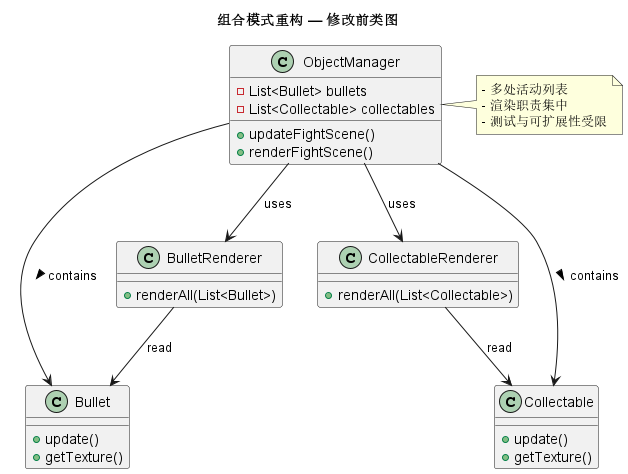
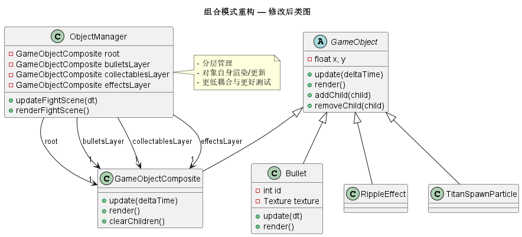

# Composite Pattern Refactor

## 1. Overview

The refactor moves the GameObject and UI subsystems toward a Composite pattern so game objects can act as leaves or containers and be managed uniformly:

- Extend `GameObject` to support children and container behavior (addChild / removeChild / getChildren / updateChildren / renderChildren).
- Introduce `GameObjectComposite` as a layer/group container that delegates update()/render() to children.
- Convert particles/effects (e.g. `RippleEffect`, `TitanSpawnParticle`) and bullets (`Bullet`) into `GameObject` leaves and add them to appropriate layers (effectsLayer, bulletsLayer).
- Make `ObjectManager` layer-centric (root, bulletsLayer, collectablesLayer, effectsLayer) so objects own update()/render(), reducing coupling with centralized renderers.
- Introduce `UIComponent` / `UIContainer` to support tree-structured UI elements while keeping backward compatibility with the previous per-manager invocation approach.

---

## 2. Files Affected (major)

- src/main/java/undertale/GameObject/GameObject.java
- src/main/java/undertale/GameObject/GameObjectComposite.java
- src/main/java/undertale/GameObject/ObjectManager.java
- src/main/java/undertale/GameObject/Effects/TitanSpawnParticle.java
- src/main/java/undertale/GameObject/Effects/RippleEffect.java
- src/main/java/undertale/GameObject/Bullets/Bullet.java
- src/main/java/undertale/UI/UIComponent.java
- src/main/java/undertale/UI/UIContainer.java
- src/main/java/undertale/UI/UIManager.java
- src/main/java/undertale/GameMain/InputManager.java (debug logs cleaned / test-friendly)

---

## 3. Before vs After — Problem, Refactor, Outcomes

### 3.1 Problems before refactor

1. Rendering and updating responsibilities were tightly coupled and centralized in renderers, making it hard to extend and test.
2. Active object management was scattered and sometimes duplicated (e.g. multiple lists for bullets), which made lifecycle management error-prone and caused duplication or race issues.
3. Extensibility was limited — adding new object types required changes at multiple central render/update locations.

### 3.2 Refactor approach

1. Introduced the composite concept — `GameObject` can be a leaf or container, and `GameObjectComposite` acts as a container layer.
2. Shifted responsibility downwards — each object implements its own update()/render(); ObjectManager only organizes layers and scheduling.
3. Layered management — ObjectManager now manages `root`, `bulletsLayer`, `collectablesLayer`, `effectsLayer` as authoritative containers.
4. UI evolution — added `UIComponent` and `UIContainer` so UI can be migrated to a root-driven tree when desired.

### 3.3 Outcomes and benefits

- Responsibilities are clearer and coupling is reduced: objects own their rendering logic while layers are traversed by ObjectManager.
- Lifecycle management is simpler and predictable via layers.
- Tests run in headless CI because rendering code is avoided in unit tests and singletons are guarded with fallbacks.
- Extensibility improves: adding new layers or object types is straightforward by implementing GameObject and adding to the appropriate layer.
- UI is better prepared for a root-driven, unified update/render pipeline.

---

## 4. UML diagrams (PlantUML)

Below are simplified PlantUML diagrams for Before / After. The repository contains the PlantUML source files in `img/composite_pattern/`.

**Before (centralized renderers + scattered lists)**

**After (composite layers + objects render themselves)**

---
